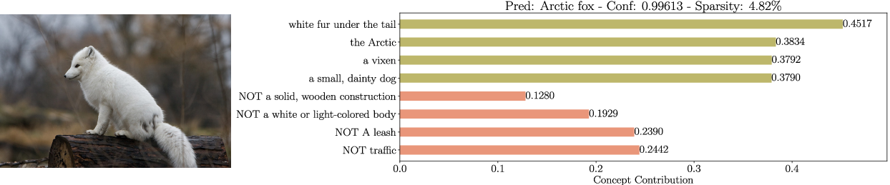
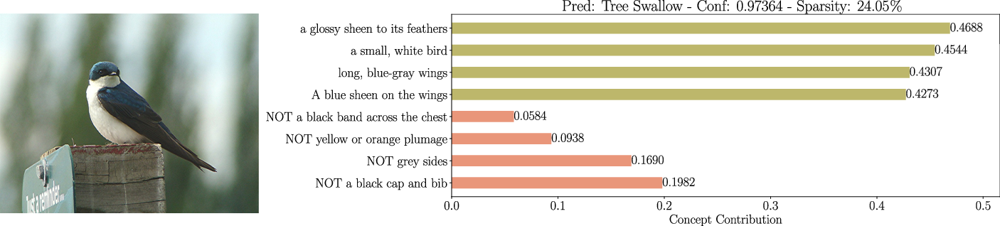

# Sparse Linear Concept Discovery Models

This is the official code implementation for the paper titled "Sparse Linear Concept Discovery Models". We propose a novel framework towards Interpretable Deep Networks using multi-modal models and a simple yet effective concept selection mechanism.  

# Setup 

The file structure to make sure that everything works as intended is the following:

```
── CDM
│   ├── clip/
│   ├── data/
│   ├── saved_models/
│   ├── main.py
│   ├── data_utils.py
│   ├── networks.py
│   ├── utils.py
│   └── README.md

```
where the `saved_models` folder will be created automatically if it doesn't already exist when running the main script.

 1. Create a venv/conda environment containing all the necessary packages. This can be achieved using the provided .yml file. 
 2. Specifically, run `conda env create -f clip_env.yml`.

When considering CUB and ImageNet, you should set it up with the standard format and provide the correct path in the `data_utils.py` file in the corresponding ImageNet entry.

# Training and Inference 

## CLIP Embeddings 
As described in the main text, the models are trained using the embeddings
arising from a pretrained clip model. To facilitate training and inference speeds, 
we first embed the dataset in the CLIP embedding space and 
use then load the embedded vectors as the dataset to be used. 
For small dataset like CIFAR-10, CIFAR-100 and CUB, this is an easy task. 
It should only take a couple of minutes to produce and save the embeddings
for all images in these datasets. ImageNet and Places365 take a lot more, considering
the highly increased number of images. 
For reproducibility and further development, we provide our image features in the following
links:


For saving the text embeddings of a different dataset, one should use the
following command:

`python main.py --dataset cifar10 --compute_similarities`

where you replace the `dataset` argument with the name of your dataset.
For this to work, you need to implement data loding function in the `data_utils.py` file.

This assumes that you use the default concept set, i.e., cifar100. To use a different concept set
(even your own), specify the name in the `concept_name` argument, and make sure that
your concept file is in the correct folder, i.e., `data/concept_sets/your_concept_set.txt`.

As an example, for using the ImageNet concept set, one could use the following command:

`python main.py --dataset cifar100 --concept_name imagenet --compute_similarities`


## Training 
Assuming that you have the embeddings already computed, you can train the linear layers from scratch on 
a given dataset. To train the network on cifar100 with the cifar100 concept set for 1000 epochs, the command is:

`python main.py --dataset cifar100 --load_similarities --concept_name cifar100 --epochs 1000 `


## Inference 
For the evaluation of a pretrained model, the command is:

`python main.py --eval --dataset cifar100 --concept_name cifar100 --load_similarities --ckpt /path/to/your/checkpoint.pth.tar`

# Experimental Evaluation  

## Accuracy and Sparsity:
<style>
table th:first-of-type {
    font-size: 10pt;
    width: 15%;
}
table th:nth-of-type(2) {
    width: 10%;
}
table th:nth-of-type(3) {
    width: 10%;
}
table th:nth-of-type(4) {
    width: 10%;
}
table th:nth-of-type(5) {
    width: 10%;
}
table th:nth-of-type(6) {
    width: 10%;
}
</style>

|                         |                    |                    | Dataset            |                    |                |
|-------------------------|--------------------|--------------------|--------------------|--------------------|--------------------|
| Model                   | CIFAR10            | CIFAR100           | CUB200             | Places365          | ImageNet       |
| Standard                | 88.80%             | 70.10%             | 76.70%             | 48.56%             | 76.13%         |
| Standard (sparse)       | 82.96%             | 58.34%             | 75.96%             | 38.46%             | 74.35%         |
| Label-free CBM          | 86.37%             |   65.27%           | 74.59%             |   43.71%           | 71.98%         |
| CDM (RN50, w/o *Z*)     | 81.90% \| --       | 63.40% \| --       | 64.70% \| --       | 52.90% \| --       | 71.20% \| --   |
| CDM (RN50, w/ *Z*)      | 86.50% \| 2.55     | 67.60% \| 9.30     | 72.26% \| 21.3     | **52.70%** \| 8.28 | 72.20% \| 8.53 |
| CDM (ViT-B/16, w/o *Z*) | 94.45% \| --       | 79.00% \| --       | 75.10% \| --       | 54.40% \| --       | 77.90% \| --   |
| CDM (ViT-B/16, w/ *Z*)  | **95.30%** \| 1.69 | **80.50%** \| 3.38 | **79.50%** \| 13.4 | 52.58% \| 8.00     | **79.30%** \| 6.96 |

## Qualitative Analysis






